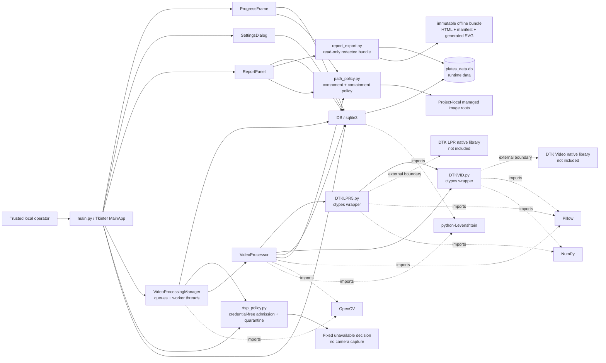
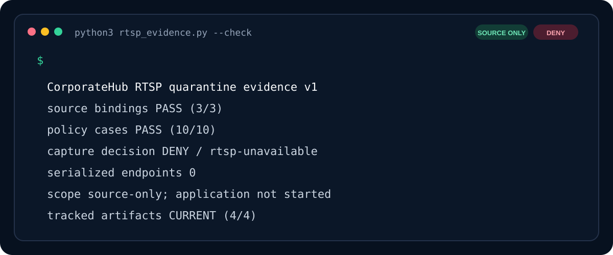
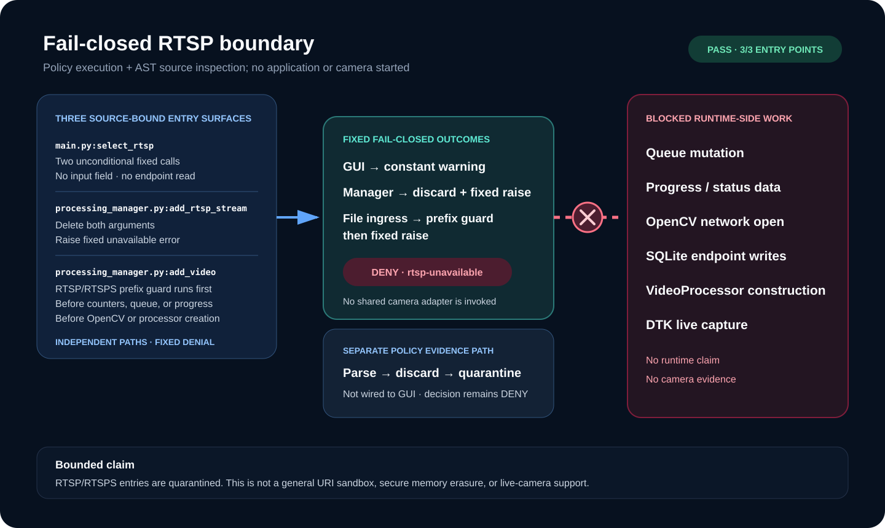
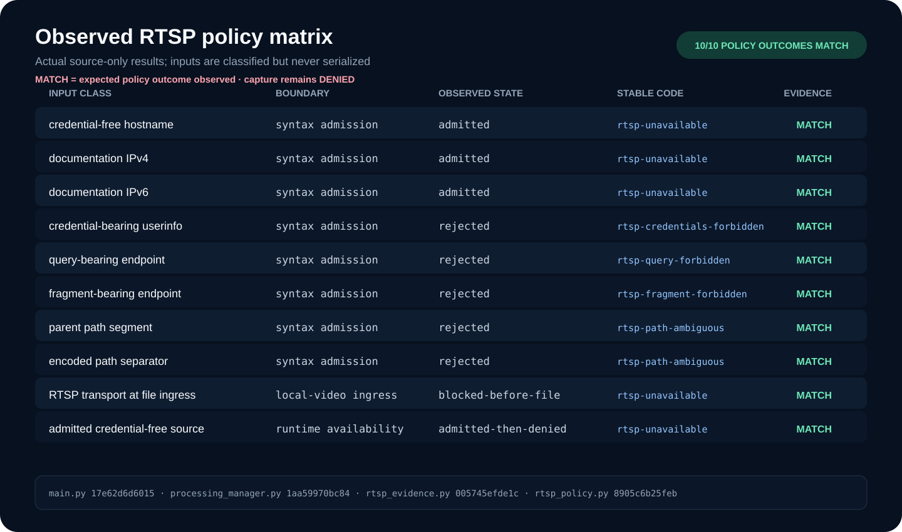

# CorporateHub: static baseline for an LPR desktop prototype

CorporateHub is a legacy Tkinter prototype for reviewing video files, passing
frames to DTK license-plate-recognition bindings, recording detections in
SQLite, and inspecting reports. This repository is being documented before
runtime rehabilitation.

The current entry point has **no authentication or authorization**. It launches
as a trusted-local prototype and must not be exposed as a shared or remote
service. No performance, security, accuracy, or production-readiness claim is
made. The repository does not currently grant an open-source license.

## Current evidence level

The baseline tests parse and inspect source without importing the application
or either vendor wrapper. The application has not been executed in this stage:
the required DTK native libraries and a compatible licensed runtime are not
present in this repository. There are therefore no truthful runtime screenshots
or benchmark results yet.

### Static architecture map — not runtime evidence

The diagram below is derived from imports, constructor calls, queue/thread code,
and filesystem/SQLite paths in the tracked Python source. It documents static
code relationships only; it does not prove that the application or any workflow
runs successfully.



## Dependency and DTK boundary

There is no dependency manifest or lock file, so the current checkout does not
define reproducible package versions. Static imports show these requirements:

- Python with Tkinter and the standard-library SQLite module. The standalone
  offline exporter requires Python 3.11+ so it can fail closed with SQLite's
  per-connection length limit;
- Pillow (`PIL`), NumPy, OpenCV (`cv2`), and `python-Levenshtein`;
- the separately supplied DTK License Plate Recognition and DTK Video Capture
  native libraries, plus whatever license the vendor requires.

`DTKLPR5.py` and `DTKVID.py` are Python `ctypes` wrappers carrying DTK Software
copyright headers. They are preserved byte-for-byte in this baseline. The
runtime code currently points at `../../lib/windows/x64/`; those native
binaries are not included, and this repository does not establish that the
path is portable or correct for a given machine. See
[THIRD_PARTY_NOTICES.md](THIRD_PARTY_NOTICES.md) for exact wrapper hashes and
the licensing boundary.

After independently supplying compatible dependencies and DTK components, the
declared GUI entry point is:

```text
python3 main.py
```

That command is documentation of the entry point, not a verified setup recipe.
Use only a trusted local machine with non-sensitive test material until the
runtime is rehabilitated and independently reviewed.

## Static workflow

The code currently describes this intended file-video path:

1. A local operator creates or selects a profile in the Tkinter UI.
2. `VideoProcessingManager` queues selected files and starts worker threads.
3. `VideoProcessor` hands captured frames to the DTK wrappers.
4. Detection callbacks update SQLite records and write plate/frame images.
5. The interactive report and settings panels query or update the same local
   database.
6. Offline export independently opens one read-only SQLite transaction and
   publishes a redacted immutable bundle; it does not call the mutable report
   analyses or import the GUI/runtime stack.

This sequence is a reading of the source, not runtime evidence.

## Source-verified path-containment increment

Four plate-derived image-write sites now pass filesystem components through a
standard-library-only path policy. Ordinary uppercase ASCII identifiers such
as `ABC123`, `AB-1234`, and `LV_42` retain their existing component names.
Lowercase variants receive a digest suffix so they remain distinct from
uppercase variants on case-insensitive filesystems. Components requiring
normalization, unsafe-character replacement, reserved-name handling, or
truncation also receive a stable digest suffix. The generated suffix namespace
is reserved so a crafted raw ASCII value cannot claim another input's generated
component. New writes are checked against the project-local `images/`,
`detection_history/`, or `blacklist_matches/` root, including checks for
existing symlink escapes. Raw recognition text remains in legacy database, UI,
matching/cache, and logging flows; only the new managed filenames use derived
components. Logging redaction is a later rehabilitation stage.

The folder actions no longer interpolate a database path into a shell command.
They derive a managed detection folder and pass an encoded local-file URI to
the browser integration. Exported-report opening uses the same URI encoder.
The separate offline exporter described below no longer copies database-named
files or launches remote report code.

This policy is defense in depth, not a complete filesystem sandbox. It does not
eliminate filesystem races, replace OS permissions, validate legacy database
paths, or establish authorization. Existing artifacts whose names were derived
by older code are not renamed or migrated; folder actions target the new
component policy, so a legacy artifact may need manual, privacy-reviewed
handling.

## Source-verified RTSP quarantine

Live-camera capture remains unavailable, but the former broken path is now
fail-closed. The GUI does not solicit an endpoint: its RTSP control shows one
fixed unavailable explanation. `VideoProcessingManager.add_rtsp_stream()`
discards its arguments and raises a fixed error before any endpoint-dependent
queue, progress, OpenCV, database-write, processor, or DTK operation. The
ordinary video-file entry point also rejects `rtsp:` and `rtsps:` transport
prefixes, including case variants and leading ASCII controls, before queueing
or opening them.

The isolated standard-library-only `rtsp_policy` module validates a deliberately
narrow, credential-free `rtsp://host[:port]/path` shape. It rejects userinfo,
queries, fragments, controls, non-ASCII input, invalid ports and hosts, and
ambiguous paths, then discards the input and exposes only fixed public metadata.
`RtspSource` cannot be constructed through its public constructor. This parser
is a policy boundary for later work, not a camera client, and the GUI does not
currently pass an endpoint to it.

Exception messages and serialized public metadata do not embed the input.
Python tracebacks retain frame locals, however, so a caught policy traceback can
still retain its endpoint; do not persist or publish such tracebacks. The
file-entry guard is RTSP-specific, not a general URI or network sandbox. Other
network-shaped strings have not yet received an equivalent source boundary.

Do not treat RTSP as a working feature. No camera stream was opened, no native
RTSP call was made, and no live-camera lifecycle was runtime-validated in this
increment.

### Reproduce the quarantine evidence

The following artifacts are source-only evidence, not camera runtime evidence.
`rtsp_evidence.py` executes ten policy cases, checks the three entry points as
AST, hashes the four evidence-bearing sources, and renders every artifact from
that single result. It never imports the GUI, OpenCV, database, vendor wrappers,
or native runtime. The tracked outputs contain no endpoint values, host state,
timestamps, absolute paths, or commit identifiers.

```text
python3 rtsp_evidence.py
python3 rtsp_evidence.py --check
python3 rtsp_evidence.py --write
```

`--check` byte-compares all tracked outputs. `--write` refuses to publish if a
policy case or source binding fails, then replaces each artifact atomically.
The canonical receipt is available as
[`evidence/rtsp-quarantine-v1.json`](evidence/rtsp-quarantine-v1.json).

[](docs/assets/rtsp-quarantine-cli.svg)

The terminal visual above is generated line-for-line from the same receipt that
the CLI prints. It reports the executed case and source-binding totals, not a
simulated application session.

[](docs/assets/rtsp-quarantine-flow.svg)

The flow visual names all three verified GUI/manager surfaces and their distinct
fixed-denial behavior. Syntax admission is shown separately because the GUI is
not wired to that future-facing policy path.

[](docs/assets/rtsp-quarantine-matrix.svg)

The matrix is rendered from the ten observed results. `MATCH` means the expected
policy outcome was observed; capture remains denied. Inputs appear only as
non-sensitive classes, while the JSON carries stable outcome codes and full
source hashes without storing the tested endpoint values.

## Source-verified redacted offline reports

The legacy HTML generator was removed rather than patched around its active
content and database-path dataflows. `report_export.py` is a standard-library-
only boundary that opens the existing SQLite file with URI `mode=ro`, enables
`query_only`, validates the two source tables, and materializes all report rows
inside one transaction. Before reading rows it lowers `SQLITE_LIMIT_LENGTH` and
rejects unsupported Python/SQLite runtimes, oversized dynamic values, and
non-numeric storage classes. Confidence aggregation uses `math.fsum`, so the
same value multiset remains stable when source row IDs change order, including
on Python 3.11. It does not import `database.py`, call the mutable
similar-plate analysis, start the GUI, or load PIL, OpenCV, DTK, or native code.

Version one has one privacy mode: `redacted-v1`. It selects only internal join
IDs, blacklist booleans, and detection confidence values. The public model
replaces identifiers with report-local `Record NNN` labels and omits raw plate
text, profiles, source filenames, reasons, exact timestamps, filesystem paths,
and source images. Stored `plate_detections` rows are labelled observation
records because legacy duplicates can exist; the report makes no deduplicated-
event claim. Redaction reduces exposure but does not guarantee anonymity, so
review aggregate counts and confidence values before sharing.

The output is a new content-addressed directory containing exactly:

```text
corporatehub-report-<sha256>/
├── index.html
├── manifest.json
└── assets/<sha256>.svg
```

The HTML and source-generated SVG are static and self-contained. The verifier
requires a restrictive CSP, no scripts, event handlers, remote URLs, forms, or
active SVG content. The SVG filename is its full content digest. The canonical
manifest carries the same redacted record model shown in HTML and binds both
public files, summary semantics, privacy contract, and report ID. Verification
strictly validates that model and regenerates both HTML and SVG byte-for-byte;
passive text injection is rejected even after hashes and the report ID are
recomputed. Before JSON allocation it bounds manifest nesting and structural
tokens; untrusted HTML/SVG bytes are compared with the expected render before
their parsers run. Publication uses a private sibling staging directory,
exclusive writes, file `fsync`, and supported directory `fsync`, then verifies
before rename. It refuses to overwrite a stale or tampered bundle. A real
directory-I/O failure before rename aborts publication; one after the atomic
rename returns a fixed durability warning because the verified bundle already
exists. This is not a race-resistant descriptor-relative filesystem sandbox;
an operator-controlled, non-symlink output parent remains part of the trust
boundary.

The manifest is content-addressed, not signed. Verification establishes the
canonical structure and source-template consistency of the bundle at its report
ID; it does not establish who created it, which database produced it, or whether
its aggregate claims are true. Provenance requires a trusted expected report ID
or an external signature.

Run the standalone boundary without importing the application:

```text
python3 report_export.py export \
  --database /absolute/path/to/plates_data.db \
  --output-parent /existing/private/report-directory
python3 report_export.py verify \
  /existing/private/report-directory/corporatehub-report-<sha256>
```

The GUI now selects an existing output directory, delegates only the database
path and directory to this exporter, then opens the verified `index.html` via
an encoded local-file URI. No runnable GUI or real surveillance-data export is
claimed in this source-only increment.

## Data and operational risks

The prototype can write license-plate text, timestamps, source filenames,
blacklist information, SQLite data, and cropped/full-frame images to the local
working tree. RTSP URLs can contain credentials, but the current GUI no longer
solicits them and the narrow parser rejects credential-bearing forms. Traceback
locals remain a sensitive diagnostic surface. Apart from the bounded path,
RTSP, and offline-report increments above, the source does not implement
encryption, authentication, authorization, retention enforcement outside the
narrow report boundary, a complete filesystem sandbox, or a tested deletion
workflow. Logs and interactive screens can add further copies. The offline
bundle deliberately omits direct identifiers and source media, but its
aggregate attributes can still be sensitive.

Use synthetic or explicitly authorized data only. Keep runtime databases,
camera media, images, logs, reports, exports, native binaries, and environment
files out of version control; the baseline `.gitignore` covers the known
locations and file classes. Offline report parents are operator-selected; save
bundles outside the checkout and inspect their canonical manifest before
sharing. See [SECURITY.md](SECURITY.md) before handling any real data.

## Source-only verification

The source-only verification suite has only Python standard-library
dependencies, invokes the Git CLI to enumerate commit candidates, and imports
the project-owned `path_policy`, `rtsp_policy`, `rtsp_evidence`, and
`report_export` modules. That source-only set does not import the GUI, mutable
database wrapper, vendor wrappers, or native runtime:

```text
python3 -m unittest discover -s tests -v
```

The checks parse Python source, verify removal of the former password gate,
bind vendor notices to exact wrapper hashes, inspect ignore coverage and
tracked runtime artifacts, exercise the isolated path policy (including
traversal, Unicode, length, digest, symlink, and URI cases), bind its call sites
through AST inspection, and scan repository text for high-confidence secret
signatures. The RTSP checks exercise endpoint classification and fixed public
metadata, bind both GUI and manager denial paths through AST inspection, and
include mutations for raw display, dead runtime calls, late guards, and queue
bypasses. Evidence checks also require the JSON and three accessible SVGs to be
deterministic, current, endpoint-free, locally linked, and sensitive to source
or artifact mutations. Offline-report checks build adversarial synthetic SQLite
snapshots, verify read-only and coherent data access, inspect the exact HTML/SVG
policy, and tamper with bundle files and manifests. They do not validate GUI
behavior, DTK licensing, recognition quality, native-library loading, video
processing, descriptor-level filesystem race resistance, real surveillance
data, or RTSP operation.

## Repository status

This is a source-only rehabilitation stage. Planned follow-up work must preserve
the vendor boundary, add reproducible dependency/runtime fixtures where
licensing permits, repair remaining behavior behind tests, and capture only
real, sanitized, reproducible visual evidence.
