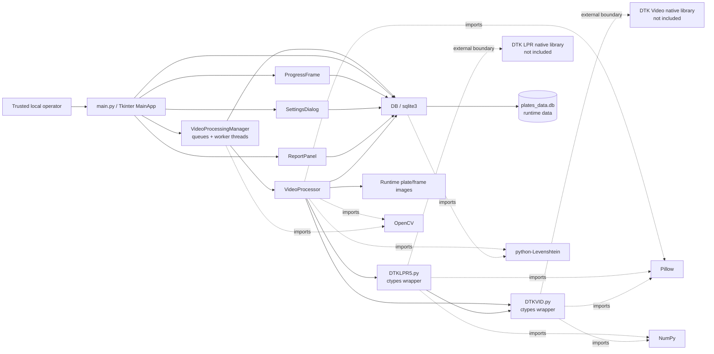

# CorporateHub: static baseline for an LPR desktop prototype

CorporateHub is a legacy Tkinter prototype for reviewing video files, passing
frames to DTK license-plate-recognition bindings, recording detections in
SQLite, and inspecting reports. This repository is being documented before
runtime rehabilitation.

The current entry point has **no authentication or authorization**. It launches
as a trusted-local prototype and must not be exposed as a shared or remote
service. No performance, security, accuracy, or production-readiness claim is
made. The repository does not currently grant an open-source license.

## Current evidence level

The baseline tests parse and inspect source without importing the application
or either vendor wrapper. The application has not been executed in this stage:
the required DTK native libraries and a compatible licensed runtime are not
present in this repository. There are therefore no truthful runtime screenshots
or benchmark results yet.

### Static architecture map — not runtime evidence

The diagram below is derived from imports, constructor calls, queue/thread code,
and filesystem/SQLite paths in the tracked Python source. It documents static
code relationships only; it does not prove that the application or any workflow
runs successfully.



## Dependency and DTK boundary

There is no dependency manifest or lock file, so the current checkout does not
define reproducible package versions. Static imports show these requirements:

- Python with Tkinter and the standard-library SQLite module;
- Pillow (`PIL`), NumPy, OpenCV (`cv2`), and `python-Levenshtein`;
- the separately supplied DTK License Plate Recognition and DTK Video Capture
  native libraries, plus whatever license the vendor requires.

`DTKLPR5.py` and `DTKVID.py` are Python `ctypes` wrappers carrying DTK Software
copyright headers. They are preserved byte-for-byte in this baseline. The
runtime code currently points at `../../lib/windows/x64/`; those native
binaries are not included, and this repository does not establish that the
path is portable or correct for a given machine. See
[THIRD_PARTY_NOTICES.md](THIRD_PARTY_NOTICES.md) for exact wrapper hashes and
the licensing boundary.

After independently supplying compatible dependencies and DTK components, the
declared GUI entry point is:

```text
python3 main.py
```

That command is documentation of the entry point, not a verified setup recipe.
Use only a trusted local machine with non-sensitive test material until the
runtime is rehabilitated and independently reviewed.

## Static workflow

The code currently describes this intended file-video path:

1. A local operator creates or selects a profile in the Tkinter UI.
2. `VideoProcessingManager` queues selected files and starts worker threads.
3. `VideoProcessor` hands captured frames to the DTK wrappers.
4. Detection callbacks update SQLite records and write plate/frame images.
5. Report and settings panels query or update the same local database.

This sequence is a reading of the source, not runtime evidence.

## Known RTSP breakage

RTSP controls are visible in the source, but the path is currently broken and
unverified:

- `VideoProcessingManager` constructs `VideoProcessor` with `is_rtsp` and
  `stream_id` keyword arguments that its constructor does not accept.
- `VideoProcessor.start_processing()` calls the wrapper's file-capture method,
  not its IP-camera capture method.

Do not treat RTSP as a working feature. No camera stream was opened during this
baseline.

## Data and operational risks

The prototype can write license-plate text, timestamps, source filenames,
blacklist information, SQLite data, and cropped/full-frame images to the local
working tree. RTSP URLs may also contain credentials and are placed in UI state
by the current code. The source does not implement encryption, authentication,
authorization, retention enforcement, redaction, or a tested deletion
workflow. Logs and exported reports can add further copies.

Use synthetic or explicitly authorized data only. Keep runtime databases,
camera media, images, logs, reports, exports, native binaries, and environment
files out of version control; the baseline `.gitignore` covers the known
locations and file classes. HTML report destinations are operator-selected;
save them outside the checkout because source HTML is intentionally not
globally ignored. See [SECURITY.md](SECURITY.md) before handling any real data.

## Source-only verification

The source-only verification suite has only Python standard-library
dependencies, invokes the Git CLI to enumerate commit candidates, and does not
import project or vendor modules:

```text
python3 -m unittest discover -s tests -v
```

The checks parse Python source, verify removal of the former password gate,
bind vendor notices to exact wrapper hashes, inspect ignore coverage and
tracked runtime artifacts, and scan repository text for high-confidence secret
signatures. They do not validate GUI behavior, DTK licensing, recognition
quality, native-library loading, video processing, database concurrency, or
RTSP operation.

## Repository status

This is the first public-baseline stage. Planned follow-up work must preserve
the vendor boundary, add reproducible dependency/runtime fixtures where
licensing permits, repair behavior behind tests, and capture only real,
sanitized, reproducible visual evidence.
